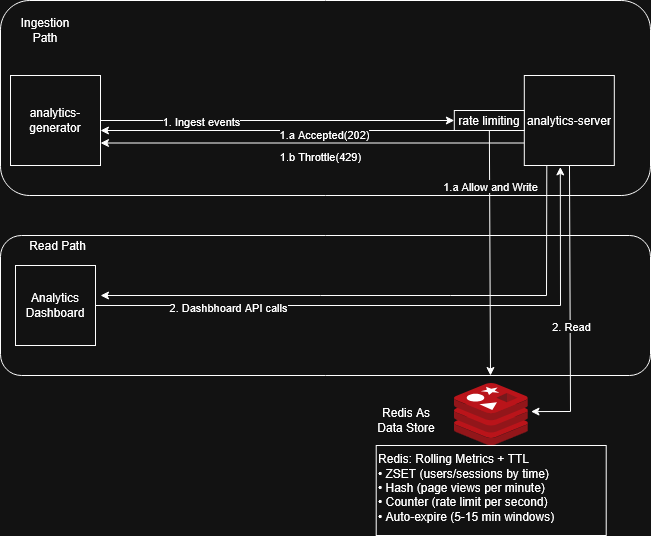

# LiftLab Analytics

A small real-time analytics service that ingests user events, keeps rolling counts in Redis, and exposes a dashboard.

## Getting started

We need Docker and Docker Compose. From the repo root:

```bash
docker compose up -d
```

Then open **http://localhost:9000** for the dashboard.

The `analytics-generator` service is **enabled by default** and will start sending mock events every 200ms. You should see "Active Users: 3" and metrics updating on the dashboard.

To stop the event stream (and watch active users count drop after 5 minutes), comment out the `analytics-generator` service in `docker-compose.yml` and run `docker compose up -d` again.


## Demo Mode: Real-Time vs Standard Refresh

The dashboard automatically refreshes every **30 seconds** (as per the requirements). However, to demonstrate how the system reacts to events in real-time, you can toggle to a **2-second refresh** mode:

- **Demo Mode (2s):** Click the "Demo Mode (2s)" button to see metrics update almost instantly as events arrive. This helps visualize the real-time behavior and how quickly the Redis aggregations work.
- **Standard Mode (30s):** The default production-grade refresh every 30 seconds. Click "Standard Mode (30s)" to revert.

Both modes run without restart. The countdown timer shows how many seconds until the next refresh. You can also manually refresh anytime with the "Refresh now" button.


## Quickstart (Windows)

From a PowerShell prompt (repo root):

```powershell
.\mvnw.cmd -pl analytics-server test
.\mvnw.cmd -pl analytics-server spring-boot:run
```

Or with Docker Compose:

```powershell
docker compose up -d
```

Open http://localhost:9000


## Example request

POST `/events` sample JSON (send with curl or any HTTP client):

```bash
curl -X POST http://localhost:9000/events \
	-H "Content-Type: application/json" \
	-d '{"timestamp":"2024-03-15T14:30:00Z","user_id":"usr_789","event_type":"page_view","page_url":"/products","session_id":"sess_456"}'
```

Expected responses:
- `202 Accepted` on success
- `400 Bad Request` for validation errors (e.g. malformed timestamp)
- `429 Too Many Requests` when rate limit exceeded

---

## Approach and design choices

The problem asked for ingest, real-time metrics, a simple dashboard, and handling on the order of 100 events/sec. The approach was to keep the pipeline linear and the storage model minimal.

**Ingest:** Events come in as JSON, are validated (required fields, format), then hit a rate limiter. If allowed, we update Redis and return 202. Validation and rate-limit errors return structured JSON (code, message, optional details) so clients can handle them consistently. The rate limiter is behind an interface so we can swap in a different implementation (e.g. in-memory or token-bucket) without touching the rest of the flow.

**Storage:** All rolling metrics live in Redis. Active users and active sessions per user are stored in sorted sets keyed by event time; we trim entries older than the window so cardinality gives the count. Page views are stored in per-minute hash buckets (minute in UTC), and the metrics API merges the last N buckets to get the rolling window. Keys use a clear prefix (`analytics:`) and descriptive names (e.g. `analytics:rate_limit:global:{second}`, `analytics:active_users`, `analytics:user:{id}:sessions`, `analytics:page_views:{bucket}`) so they’re easy to reason about and to change later (e.g. add a tenant or env prefix). Redis access is behind an `AnalyticsStore` interface; the current implementation is Redis-based, but the aggregation and metrics logic don’t depend on Redis directly, so we could plug in another store if needed.

**Why these windows:** 5 minutes for “active” and 15 for page views is a balance between recency and stability and matches the problem spec. All window sizes and the rate limit are configurable via properties/env so we can tune without code changes.

**Tradeoffs:** We didn’t persist raw events; the service is optimized for “what’s happening now” rather than historical analysis. Adding a proper event store or log would be a separate step. Rate limiting is global per second; it’s simple and good enough for the target load. For multi-tenant or per-key limits we’d add another implementation of the same interface. Timestamps in events are optional — when the field is missing we use server ingest time. Malformed timestamps are rejected with `400 Bad Request` to avoid silently skewing time-based metrics; clients should send ISO-8601 strings like `2024-03-15T14:30:00Z`.

---

## Scaling

For a single region and moderate load, we can run multiple instances of the app behind a load balancer. They all talk to the same Redis, so active-user and session counts stay consistent. Rate limiting is already global (Redis key per second), so we don’t get a multiplied limit when we add instances.

If Redis becomes the bottleneck, we can shard by metric type (e.g. one Redis for rate limit and active users, another for page-view buckets) or by tenant/user segment if we introduce tenancy. The `AnalyticsStore` abstraction makes it easier to introduce a different backend (e.g. a time-series DB for page views) without rewriting the rest.

For very high throughput we’d typically introduce a queue: ingest writes to a stream or queue and returns 202, and workers consume and update ClickHouse which is optimized for events stream and propagate the same to Redis via CDC. That adds latency to the “real-time” view but lets we absorb spikes. The current design is synchronous so that we keep the demo simple and the behaviour easy to reason about.

---

## API

| Method | Path | Description |
|--------|------|-------------|
| POST | `/events` | Ingest one event. Body: JSON with `timestamp` (optional, ISO-8601 — malformed timestamps return 400), `user_id`, `event_type`, `page_url`, `session_id`. Returns 202, or 400 (validation) / 429 (rate limit). |
| GET | `/metrics/active-users` | Active users in the last 5 minutes. Response: `{ "activeUsersCount": number, "windowMinutes": 5 }`. |
| GET | `/metrics/top-pages` | Top 5 pages by view count in the last 15 minutes. Response: `{ "windowMinutes": 15, "topPages": [ { "url": string, "count": number } ] }`. |
| GET | `/metrics/active-sessions?userId=<id>` | Active sessions for that user in the last 5 minutes. Response: `{ "userId": string, "activeSessionsCount": number, "windowMinutes": 5 }`. |

All metrics responses use fixed shapes (no bare maps) so clients and docs stay consistent.

---

## Architecture (high level)

Events go: Client → Ingest API → validation → rate limiter → aggregation → Redis. 
The dashboard (static HTML/JS) polls the metrics endpoints every 30 seconds and renders the counts. 
The mock generator is a separate process that posts events on a timer; it has no dependency on Spring or the main app.



---

## Tests

```bash
mvn -pl analytics-server test
```

Tests cover the ingest and metrics controllers (valid event, rate limit, validation error, and the three metrics endpoints) and the aggregation service (that a page_view event results in the right store calls). Rate limiting and storage are mocked so tests stay fast and don’t need Redis.

---

## Checklist vs problem statement

| Requirement | Done |
|-------------|------|
| Ingest JSON events, validation, error handling | ✓ |
| Rate limit / control events | ✓ (configurable, 429 when exceeded) |
| Event fields: timestamp, user_id, event_type, page_url, session_id | ✓ |
| Real-time: active users (5 min), page views by URL (15 min), active sessions per user (5 min) | ✓ |
| DB/cache for aggregations | ✓ Redis |
| Dashboard: single page, active users, top 5 pages, active sessions, auto-refresh 30s | ✓ |
| Mock generator: standalone, random events, contract, regular intervals until stopped | ✓ |
| Docker, README (setup, API, architecture, future improvements) | ✓ |

---

## Assumptions

- Timestamp in the payload is optional; if missing or invalid we use the time at ingest. Rate limit is 100 events/sec by default, overridden via config. Rolling windows are implemented with Redis sorted sets (score = event time) and minute-bucketed hashes for page views; we trim or expire so old data doesn’t grow unbounded.
- Timestamp in the payload is optional; if missing we use server ingest time. Malformed timestamps are rejected with `400 Bad Request`. Rate limit is 100 events/sec by default, overridden via config. Rolling windows are implemented with Redis sorted sets (score = event time) and minute-bucketed hashes for page views; we trim or expire so old data doesn’t grow unbounded.
